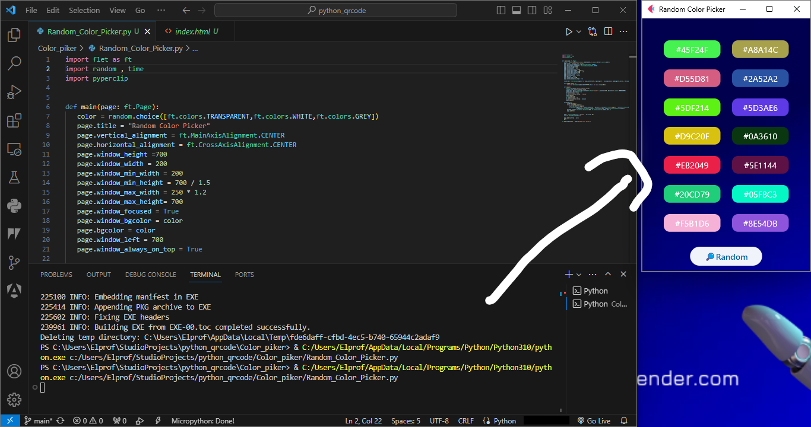
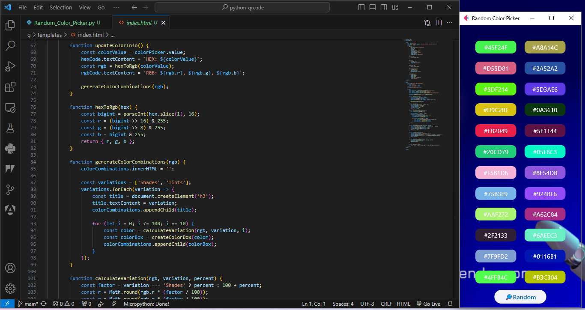

# Random Color Generator

A simple Flet application that generates random hex colors. This can be useful for developers and designers

<!-- application of random generation of hex colors to make life easier for devs and designers
create with python flet framework -->


# Random Color Generator

looking for inspiration or testing.

## Usage

1. Clone the repository:

    ```bash
    git clone https://github.com/your-username/random-color-generator.git
    ```

2. Navigate to the project directory:

    ```bash
    cd random-color-generator
    ```

3. Install dependencies:

    ```bash
    pip install Flet
    ```

4. Run the Flask application:

    ```bash
    python app.py
    ```

5. Bigoo the random color generator is in action.

## Screenshots





## Contributing

If you would like to contribute to this project, feel free to open an issue or submit a pull request.

## License

This project is licensed under the MIT License - see the [LICENSE](LICENSE) file for details.
